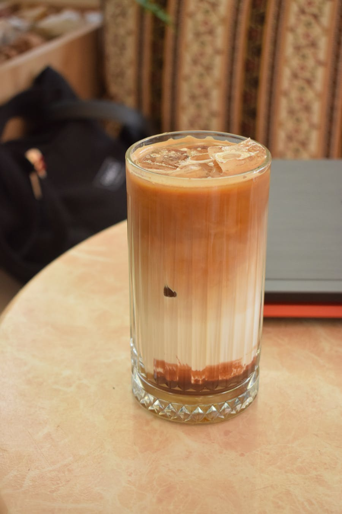

# 菠萝拿铁

> 菠萝酸甜加牛奶，热带感明显。 `冷/热` ``
> 主要材料：浓缩咖啡、菠萝汁、牛奶、冰块

## 口味

菠萝酸甜加牛奶，热带感明显。

## 材料

- 浓缩咖啡
- 菠萝汁
- 牛奶
- 冰块

## 比例

浓缩咖啡 36ml：菠萝汁 60ml：牛奶 120ml

## 步骤

1. 杯中加入菠萝汁和牛奶。
2. 冷饮加冰，热饮建议只温热牛奶。
3. 倒入浓缩咖啡，轻轻搅拌。

## 适合冷热

冷/热

## 失败风险

中。

## 备注

菠萝酸度高，和牛奶混合可能有轻微絮状感。
