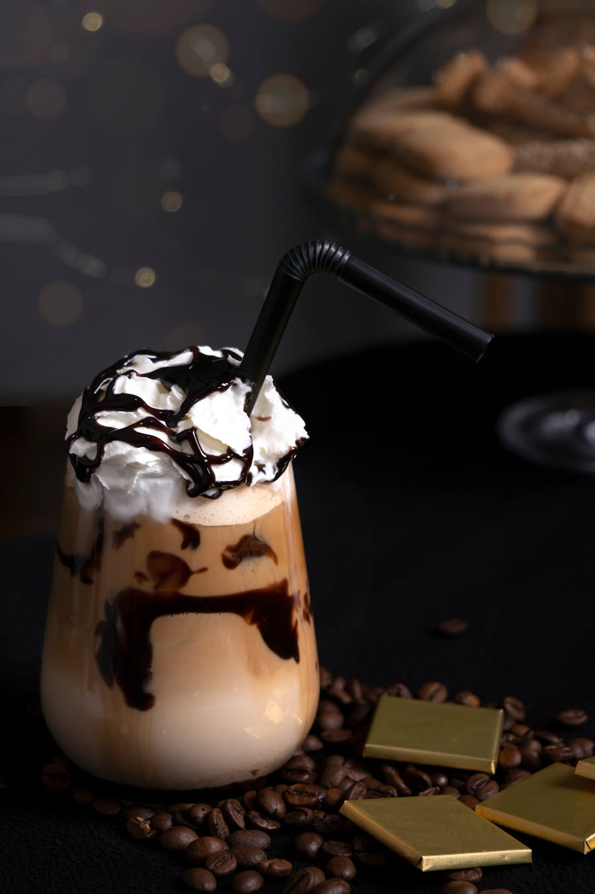

# 轻芝士拿铁

> 轻芝士咸甜，奶感厚但不压咖啡。 `冷/热` ``
> 主要材料：浓缩咖啡、牛奶、奶油奶酪、淡奶油、海盐

## 口味

轻芝士咸甜，奶感厚但不压咖啡。

## 材料

- 浓缩咖啡
- 牛奶
- 奶油奶酪
- 淡奶油
- 海盐

## 比例

浓缩咖啡 36ml：牛奶 150ml：轻芝士奶盖 45ml

## 步骤

1. 奶油奶酪、淡奶油和海盐打顺。
2. 牛奶和咖啡混合成拿铁。
3. 把轻芝士层铺在表面。

## 适合冷热

冷/热

## 失败风险

中。

## 备注

奶盖太厚会影响入口，打到缓慢流动即可。
